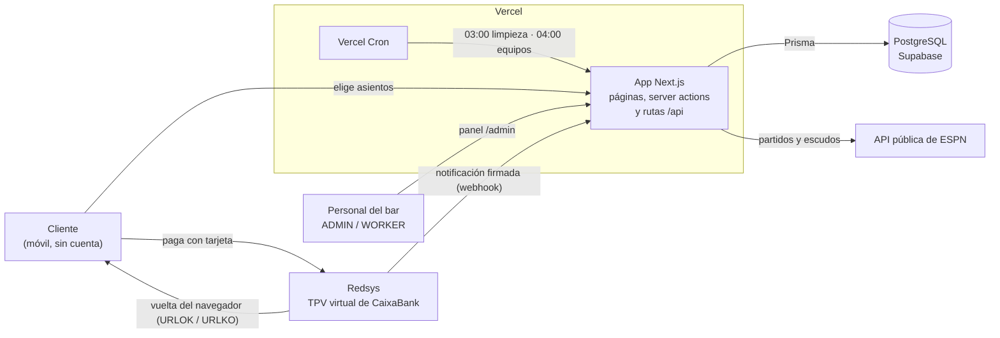
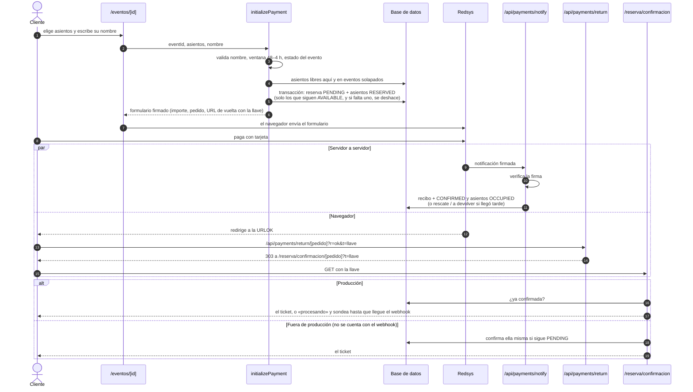

# Arquitectura

Una aplicación Next.js 16 (App Router) desplegada en Vercel, con PostgreSQL en Supabase y pagos por
Redsys. Sirve a dos públicos con la misma base de código: el cliente del bar, que reserva y paga
asientos desde el móvil sin registrarse, y el personal, que gestiona eventos y reservas desde un
panel con login.

Este documento explica cómo encajan las piezas. El detalle de las tablas está en
[`modelo-de-datos.md`](modelo-de-datos.md). Los entornos, en [`entornos.md`](entornos.md). Las
decisiones y su porqué, en [`adr/`](adr/).

## Contexto



| Sistema | Para qué | Cómo se habla con él |
|---|---|---|
| **Supabase** | La única base de datos: eventos, asientos, reservas, usuarios | Prisma, a través del pooler de Supabase |
| **Redsys** | Cobrar. La app nunca ve la tarjeta | Formulario firmado con HMAC-SHA256 en modo redirección, y notificación firmada de vuelta |
| **ESPN** | Equipos, escudos y partidos para sugerir eventos | API pública sin clave, solo desde el servidor. Los escudos se descargan y se sirven desde `public/` |
| **Vercel Cron** | Limpiar reservas caducadas y eventos antiguos, y sincronizar equipos | Llama a `/api/cron/*` con `CRON_SECRET`. No corre en las previews |

## Cómo está organizado el código

```
src/
├── app/            Rutas: páginas, loading.tsx y rutas /api
├── modules/        Un módulo por dominio de negocio
│   └── <dominio>/
│       ├── actions/    Server actions: lo que el navegador puede llamar
│       ├── domain/     Reglas puras: sin Prisma, sin "use server"
│       ├── lib/        Código de servidor que el navegador NO puede llamar
│       ├── components/
│       └── types/
├── components/ui/  Primitivas de interfaz (shadcn / Radix)
├── shared/         Piezas comunes a varias pantallas
└── lib/            Infraestructura: Prisma, Redsys, guardias de sesión, URL base
```

La distinción que más importa es la de las tres carpetas de cada módulo, porque en Next.js
**todo lo que se exporta desde un fichero `"use server"` es un endpoint público**: el navegador
puede llamarlo con los argumentos que quiera, pase o no por la página que lo usa.

| Carpeta | Qué va | Regla |
|---|---|---|
| `actions/` | Server actions: lo que las pantallas llaman para leer o escribir | Cada una se protege a sí misma: `requireAuth`, `requireAdmin`, o la llave de la reserva. Si es pública, se diseña pensando en que la llamará cualquiera |
| `domain/` | Reglas de negocio: importes, ventana de reserva, solapes, caducidad, resultado de un pago | Funciones puras. El reloj entra como parámetro. Se prueban sin base de datos |
| `lib/` | Código de servidor con efectos que no debe ser un endpoint: guardar el recibo, confirmar desde la página, resolver un pago tardío, caducar una reserva | Sin `"use server"`, a propósito. Lo llaman solo rutas y páginas que ya han hecho su comprobación |

Los módulos son:
- `payments`: el pago con Redsys;
- `reservations`: reservas, informes y devoluciones;
- `seating`: asientos, plano y bloqueos;
- `events`: eventos, ventana de reserva y títulos;
- `football-data`: la integración con ESPN;
- `auth`: login y sesión;
- `users`: el personal.

`payments/actions` solo exporta `initializePayment` y `getReservationByOrderId`, y un test lo
comprueba: añadir una acción a ese fichero es abrir un endpoint en el camino del dinero.

## Autenticación y roles

El panel se protege en tres capas. Solo la última es imprescindible, porque es la única que no se
puede esquivar llamando directamente a una acción:

1. **`middleware.ts`**: sin cookie de sesión, cualquier ruta de `/admin` redirige al login. La
   cookie no basta: `getSessionData` relee al usuario en la base en cada petición, y si lo han
   borrado o le han cambiado la contraseña, el layout del panel lo manda al login (RCA-286).
2. **Las páginas del ADMIN** llaman a `redirectUnlessAdmin()`, que devuelve al WORKER al menú.
3. **Cada server action** llama a `requireAuth()` (basta con tener sesión) o a `requireAdmin()`
   (hace falta el rol).

| | ADMIN | WORKER |
|---|---|---|
| Ver eventos y reservas, detalle de cada reserva | ✓ | ✓ |
| Bloquear asientos para un evento | ✓ | ✓ |
| Ver el aviso de pagos a devolver | ✓ | ✓ |
| Marcar un pago como devuelto | ✓ | |
| Crear, editar y borrar eventos; sugerencias de ESPN | ✓ | |
| Mover asientos y carteles del plano | ✓ | |
| Informes mensuales en PDF | ✓ | |
| Gestionar usuarios | ✓ | |

La sesión es una cookie cifrada con `iron-session`: `httpOnly`, `sameSite=lax`, siete días de
vida y `secure` en producción. La contraseña se guarda con bcrypt. El login limita los intentos
fallidos por IP.

El cliente no tiene cuenta. Lo que le da acceso a su reserva es la **llave** de la reserva
(`accessToken`), que viaja en las URL de vuelta del pago. El nº de pedido solo no basta, porque
sale del reloj y se adivina.

## El flujo de pago

Es el camino más delicado de la aplicación, y el que más decisiones concentra.



Las reglas que sostienen este flujo:

- **El importe lo calcula el servidor**, en céntimos enteros y con los precios de la base de
  datos. Del navegador solo llegan el evento, los asientos y el nombre.
- **Apartar los asientos es atómico.** El `updateMany` solo cuenta los asientos que siguen
  `AVAILABLE`, y Postgres vuelve a evaluar esa condición si otra transacción los ha tocado. Si
  no salen todos, se deshace la reserva entera. Así dos clientes simultáneos no se llevan el
  mismo asiento.
- **En producción, la única prueba de cobro es la notificación firmada de Redsys.** La página de
  confirmación no confirma nada: espera. Fuera de producción no se cuenta con el webhook, porque
  en local nunca llega (Redsys no alcanza `localhost`), así que la página confirma ella misma.
  En las previews el webhook sí suele llegar, y lo que llegue antes gana sin pisar al otro. Esa
  guarda vive dentro de `confirmReservationByOrderId`, no en la página.
- **La vuelta pasa por una ruta, no directamente a la página.** Las páginas del App Router no
  responden a POST, y Redsys hará POST el día que se active el envío de parámetros en las URL de
  respuesta. La ruta acepta los dos métodos, anota el recibo si viene firmado y redirige con 303.
- **Todo es idempotente**, porque Redsys repite notificaciones y el cliente recarga. Confirmar
  una reserva confirmada no cambia nada, y el primer recibo que se guarda es el que queda.
- **Un pago que llega tarde no se pierde.** Si la reserva caducó mientras el cliente estaba en la
  pasarela, el webhook recupera esos mismos asientos si siguen libres. Si no, la deja cobrada y
  anulada, y el panel avisa de que hay que devolver el dinero. Los estados están en
  [`modelo-de-datos.md`](modelo-de-datos.md#estados-de-una-reserva).

## Tareas programadas

Vercel Cron llama a dos rutas, autenticadas con `Authorization: Bearer <CRON_SECRET>`. Las horas
están en UTC:

| Ruta | Cuándo | Qué hace |
|---|---|---|
| `/api/cron/cleanup` | 03:00 | Caduca las reservas `PENDING` de más de 5 minutos y borra los eventos jugados hace más de 90 días, con sus reservas |
| `/api/cron/sync-teams` | 04:00 | Sincroniza equipos y escudos de las 17 competiciones desde ESPN. Nunca pisa un escudo ya descargado |

Que el cron de limpieza pase una vez al día no deja asientos bloqueados durante horas: al abrir
la página de un evento, se caducan en el momento sus reservas pendientes vencidas.

En las previews de Vercel los crons no corren. En `academic` y `testing` se lanzan a mano con el
secreto.

## La interfaz

- **Server Components por defecto.** Cada `page.tsx` lee los datos en el servidor y pasa lo
  necesario a un `client.tsx` cuando hay interacción: el plano, los formularios, el ticket.
- **Estados de carga.** Cada ruta tiene un `loading.tsx` que imita la pantalla de destino, y
  `<Link>` lo precarga, así que el skeleton sale en cuanto se pulsa. La tarjeta pulsada muestra
  además un indicador propio (`useLinkStatus`). Las animaciones van todas bajo `motion-safe:`.
- **Los PDF se generan en el navegador**, con jsPDF: el ticket, el recibo y los informes
  mensuales. El servidor no genera ni guarda ningún fichero. El ticket lleva un QR con el
  enlace a la reserva en el panel, para que el personal la abra al escanearlo.
- **Tras una acción que navega**, el botón se queda pendiente hasta que la navegación termina y
  solo se reactiva si hay error. Así un segundo toque no repite la acción.
- **Dos idiomas, solo en los textos que explican reglas.** El aviso de la portada, el tooltip de
  un evento cerrado, las condiciones, el modal del nombre y el aviso de reserva cerrada salen en
  español o en inglés según el idioma del navegador (`useIsSpanish`). El servidor pinta siempre
  en español, para que la hidratación coincida, y el cliente cambia a inglés justo después. Los
  títulos, la leyenda del plano, la confirmación, el ticket y el panel están solo en español.
- **La selección de asientos** vive en un store de Zustand (`use-reservation-store.ts`) mientras
  el cliente elige. Lo demás se lee del servidor en cada pantalla.

## Datos externos: ESPN

ESPN es solo una fuente en el momento de sincronizar: la web pública no hace ninguna petición a
sus servidores. Los escudos se descargan a `public/escudos/` con un script y se versionan en git,
porque Vercel tiene el sistema de ficheros en solo lectura y el cron no puede escribirlos. Un
equipo nuevo que crea el cron apunta a ESPN hasta que se ejecuta ese script.

Las sugerencias de partidos del panel se piden a ESPN en el momento. Crear un evento a partir de
una es idempotente: `Event.externalMatchId` es único.

## Qué no hay, a propósito

- **Cuentas de cliente.** Reservar no pide registro. El nombre es un alias para que el personal
  encuentre la reserva, y la llave de la URL sustituye al login.
- **Email.** La app no pide ni envía correos. El ticket se descarga en la pantalla de
  confirmación. El envío por email está planificado en
  [`historico/PLAN_IMPLEMENTACION_MAIL_CLIENTE.md`](historico/PLAN_IMPLEMENTACION_MAIL_CLIENTE.md),
  sin implementar.
- **Devoluciones automáticas.** Un pago a devolver se devuelve a mano en el portal de Redsys, y
  en el panel se marca como devuelto. La app no mueve dinero por su cuenta.
