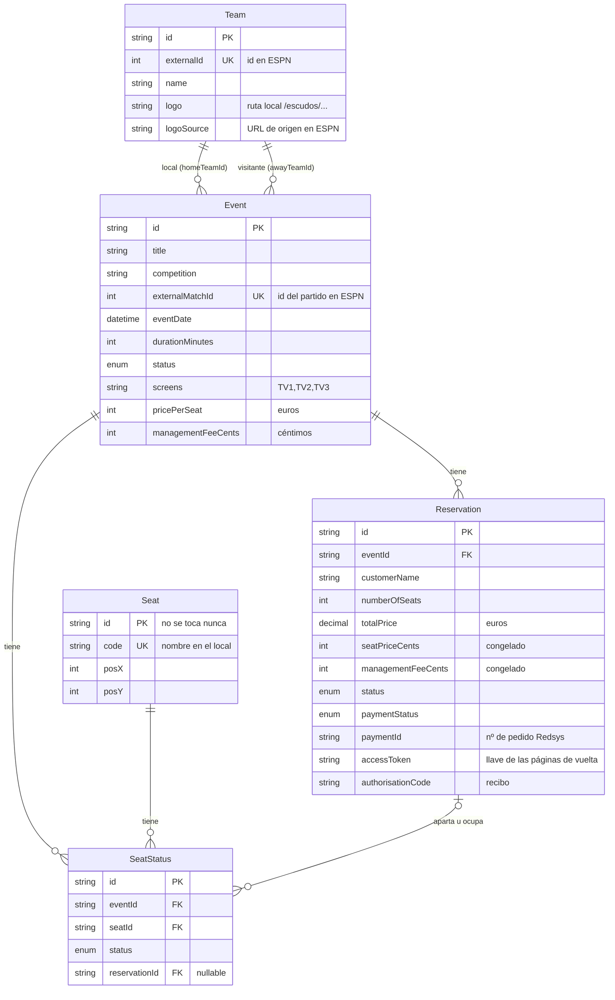
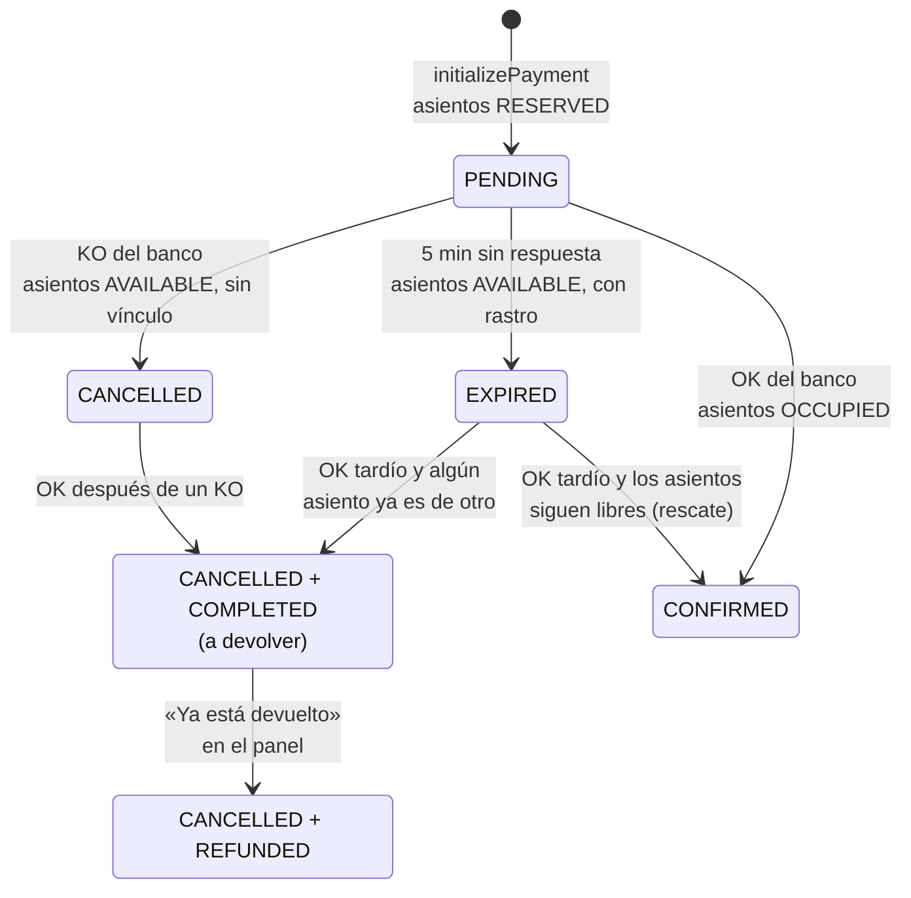

# Modelo de datos

PostgreSQL en Supabase, con Prisma 6 como ORM. La fuente de verdad es
[`prisma/schema.prisma`](../prisma/schema.prisma), más las seis migraciones de
[`prisma/migrations/`](../prisma/migrations/). Una de ellas añade un `CHECK` que el esquema de
Prisma no sabe expresar. Este documento no repite cada campo: explica cómo encajan las piezas y
qué reglas hay que respetar al tocarlas.

## Las siete tablas

`AdminUser` y `ZoneLabel` no tienen relaciones y no salen en el diagrama.

| Tabla | Qué es | Filas en producción |
|---|---|---|
| `Seat` | Los asientos físicos del local, con su posición en el plano | Fija: 47 |
| `Event` | Un partido o evento que se emite en el bar | Crece y se purga |
| `SeatStatus` | El estado de **un asiento en un evento** | 47 por evento abierto |
| `Reservation` | Una compra: el cliente, el importe y el estado del pago | Crece y se purga |
| `Team` | Equipos sincronizados desde ESPN, con su escudo | Crece con el sync |
| `AdminUser` | Personal del bar con acceso al panel, `ADMIN` o `WORKER` | Unas pocas |
| `ZoneLabel` | Posición de los carteles `TV1`, `TV2` y `TV3` sobre el plano | Una por pantalla |

## La pieza central: `SeatStatus`

Un asiento no está libre u ocupado en general, sino **en un evento**. `SeatStatus` es la tabla
cruzada entre `Seat` y `Event`, y es la que se lee y se escribe en cada compra.

- **Se crea tarde.** Las 47 filas de un evento se crean la primera vez que alguien abre su página
  (`initializeSeatsForEvent`), no al crear el evento. Hasta entonces, un asiento sin fila se trata
  como `AVAILABLE` (`seating/domain/availability.ts`).
- **`@@unique([eventId, seatId])`**: un asiento tiene un único estado por evento. Es lo que
  impide que dos filas digan cosas distintas del mismo asiento.
- **Estados:**
  - `AVAILABLE`: libre;
  - `RESERVED`: apartado por una reserva que está en la pasarela;
  - `OCCUPIED`: pagado;
  - `BLOCKED`: el bar lo ha retirado de la venta en ese evento.
- **`reservationId`** apunta a la reserva que lo aparta u ocupa. Un asiento `AVAILABLE` puede
  conservar el de una reserva caducada: es un rastro, y se explica en la sección de estados.

### El local es uno

Si dos eventos se solapan en el tiempo, un asiento vendido en uno está ocupado en el otro, aunque
en su propio `SeatStatus` diga `AVAILABLE`. El esquema no lo puede expresar, porque cada evento
tiene sus propias filas, así que lo aplica el código:

- La ventana de un evento es `[eventDate, eventDate + durationMinutes)`. Dos partidos pegados no
  se solapan (`events/domain/overlap.ts`).
- El plano del cliente pinta como ocupados los asientos tomados en un evento solapado, salvo que
  estén `BLOCKED` en el propio (`applyOverlapOccupancy`).
- `initializePayment` y el rescate de un pago tardío rechazan un asiento tomado en un evento
  solapado.

## Invariantes

Van de más a menos fuertes: primero lo que garantiza la base de datos, después lo que garantiza
el código.

| Regla | Quién la garantiza |
|---|---|
| `totalPrice * 100 = (seatPriceCents + managementFeeCents) * numberOfSeats` | **La BD**: `CHECK reservation_total_matches_breakdown` |
| Un asiento, un estado por evento | **La BD**: índice único `SeatStatus(eventId, seatId)` |
| `Seat.code` único | **La BD**: índice único `Seat_code_key` |
| Un partido de ESPN, un evento | **La BD**: índice único `Event.externalMatchId` |
| Toda reserva lleva su desglose | **Prisma**: `seatPriceCents` y `managementFeeCents` no tienen `DEFAULT`, así que el cliente exige rellenarlos |
| Dos clientes no se llevan el mismo asiento | **El código**, dentro de la transacción: el `updateMany` solo cuenta asientos `AVAILABLE`, y si no salen todos, se deshace (RCA-175) |
| Solo se cobra entre 48 h y 4 h antes, y con el evento `UPCOMING` | **El código**: `events/domain/booking-window.ts`, en el servidor |
| `Seat.code` único **sin distinguir mayúsculas**, de 10 caracteres como mucho y con solo `[A-Za-z0-9_-/.]` | **El código**: `scripts/rename-seats.ts`, el único camino que lo cambia |
| `managementFeeCents` entre 0 y 500, en pasos de 50 | **El código**: la server action, contra `MANAGEMENT_FEE_OPTIONS_CENTS` |

### El dinero

- **Se calcula en céntimos enteros**, en `payments/domain/amount.ts`. Nunca con decimales.
- **La reserva congela lo que pagó.** `seatPriceCents` y `managementFeeCents` se copian del evento
  en el momento de la compra. El ticket y el detalle del panel los leen de la reserva, así que
  editar el precio del evento no reescribe reservas ya cobradas.
- `totalPrice` es `DECIMAL(65,30)` en euros, por herencia del esquema original. Hay que pasarlo a
  `Number()` antes de enviarlo al cliente, porque el `Decimal` de Prisma no se serializa. El
  `CHECK` impide que se desvíe del desglose.
- **Los gastos de gestión no son descontables** en consumiciones, y el precio del asiento sí. Por
  eso se guardan por separado y no solo el total.

## Estados de una reserva

`status` dice qué pasa con la reserva, y `paymentStatus` qué pasa con el dinero. Casi siempre van
de la mano. La excepción es la reserva cobrada sin asientos, que hay que devolver.

| `status` | `paymentStatus` | Significado |
|---|---|---|
| `PENDING` | `PENDING` | El cliente está en la pasarela. Sus asientos están `RESERVED` |
| `CONFIRMED` | `COMPLETED` | Pagada. Sus asientos están `OCCUPIED` |
| `CANCELLED` | `FAILED` | El banco la rechazó. Sus asientos vuelven a estar libres |
| `EXPIRED` | `PENDING` | Pasaron 5 minutos sin respuesta del banco |
| `CANCELLED` | `COMPLETED` | **Cobrada sin asientos: hay que devolver el dinero.** El panel la avisa (`needsRefund`) |
| `CANCELLED` | `REFUNDED` | Ya devuelta en el portal de Redsys |

Detalles que no se ven en el diagrama:

- **Quién la caduca.** El cron de limpieza, y también la página del evento al abrirse, así que
  los asientos se liberan aunque el cron no haya pasado. Solo caduca si sigue `PENDING`
  (`reservations/lib/expire.ts`): si el webhook confirmó entre medias, no se toca.
- **El rastro.** Al caducar, los asientos quedan `AVAILABLE` pero conservan el `reservationId`.
  No los hace parecer ocupados, porque la disponibilidad solo mira `status`, y es lo que permite
  recuperar esos mismos asientos si el pago llega tarde. Se recuperan todos o ninguno: una reserva
  de tres asientos con dos recuperados sigue habiendo cobrado tres (`payments/lib/settle-payment.ts`).
- **Redsys repite notificaciones.** Todo el camino es idempotente: confirmar una `CONFIRMED` no
  cambia nada, y una `REFUNDED` no se reabre.
- **`paymentStatus` = `REFUNDED` solo lo escribe una persona**, con el botón del panel, después
  de devolver el dinero en el portal de Redsys. La app no devuelve dinero por su cuenta.

## Cuánto dura cada cosa

| Qué | Cuánto | Dónde |
|---|---|---|
| Una reserva `PENDING` | 5 minutos | `reservations/domain/expiry.ts` |
| Un evento, con sus reservas y sus `SeatStatus` | 90 días después de jugarse | El mismo fichero. Lo aplica el cron de limpieza |

El borrado de un evento arrastra sus reservas y sus `SeatStatus` (`ON DELETE CASCADE`). **La base
de datos no es un archivo contable**: a los 90 días, el registro de un cobro está en Redsys y en
los informes mensuales en PDF que se descargan desde el panel, no aquí.

Borrar un equipo deja los eventos sin equipo (`ON DELETE SET NULL`), no los borra.

## Campos con historia

- **`Seat.id` no se toca nunca.** En las 47 filas actuales coincide con el nombre original del
  asiento, que fijó el seed, y `SeatStatus.seatId` es clave ajena contra él. El nombre que ve el
  cliente es `code`, y se cambia con `scripts/rename-seats.ts`.
- **`Seat.zone`, `row` y `number` son vestigiales.** El nombre del asiento ya no codifica zona ni
  fila. Siguen porque son `NOT NULL` y quitarlos sería una migración a cambio de nada. Ningún
  camino vivo los lee, y las ordenaciones van por `code`.
- **`Event.screens`** es texto separado por comas (`"TV1,TV3"`), no una tabla. Su `@default`
  sigue diciendo `PROYECTOR`, el nombre antiguo de `TV3`: ningún camino de creación lo usa, y
  cambiarlo pediría una migración.
- **`Reservation.paymentDateTime` es texto, no `DateTime`.** Guarda literalmente la fecha y la
  hora que manda Redsys, en hora española, para que el recibo diga lo mismo que el banco. El
  instante de máquina es `confirmedAt`.
- **`Reservation.accessToken`** es la llave aleatoria que abre las páginas de vuelta del pago,
  porque el nº de pedido sale del reloj y se adivina. Viaja solo en las URL de vuelta firmadas
  para Redsys. Vale `NULL` en las reservas anteriores a septiembre de 2026, que se siguen abriendo
  con el nº de pedido solo: sus URL ya estaban repartidas.
- **`Reservation.customerName`** vale `"Cliente"` en las reservas anteriores a agosto de 2026, y
  la app lo muestra como «Sin nombre».
- **`Reservation.customerEmail`** vale siempre `cliente@lounge.com`: la app no pide el email.
  `customerPhone` no se rellena nunca.
- **`Team.logo`** es lo que pinta la app, una ruta local `/escudos/{id}.png`. `logoSource` es la
  URL de ESPN de la que salió. El sync nunca sobrescribe un `logo` local.

## Lo que el esquema no garantiza

Son hallazgos conocidos y sin arreglar. El primero y el tercero están anotados en `MASTER_IA.md`
(P7.5). El segundo apareció al escribir este documento.

- **`Reservation.paymentId` no es único.** El nº de pedido sale del reloj, con 12 dígitos. Dos
  pedidos en el mismo instante chocarían, y la base no lo impediría.
- **`EventStatus` casi no se usa.** Todos los eventos se crean `UPCOMING` y ningún camino de la
  app escribe `LIVE`, `FINISHED` ni `CANCELLED`. Los eventos pasados se distinguen por la fecha.
  El código sí respeta los otros estados si alguien los pone a mano en la base: un evento que no
  está `UPCOMING` no admite reservas.
- **El solape entre eventos se comprueba fuera de la transacción de compra.** Dos compras
  simultáneas del mismo asiento en dos eventos solapados podrían pasar las dos. La carrera dentro
  de un mismo evento sí está cerrada.

## Cambiar el esquema

Las migraciones de producción se aplican a mano. No hay despliegue automático de migraciones:
el procedimiento está en `docs/entornos.md`. Los tests de integración corren contra un Postgres
real en Docker al que se le aplican las mismas migraciones con `migrate deploy`. Así el `CHECK` de
importes también existe en los tests, y hay tests que comprueban que está y que rechaza un total
descuadrado (`tests/integration/andamiaje.test.ts` y `payments-initialize.test.ts`).
