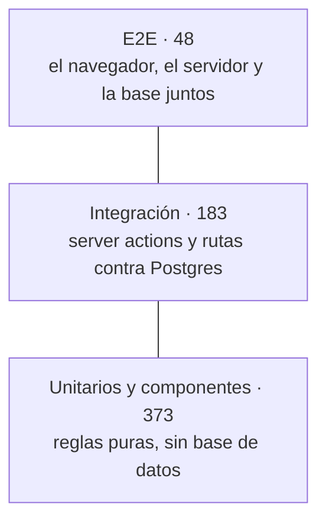

# Testing

La aplicación empezó sin ningún test y con cobros reales en producción. La suite se construyó en
septiembre de 2026 con un orden que importa: primero se fijó lo que el código **hacía**, después
se refactorizó sin cambiar ese comportamiento, y solo entonces se arreglaron los fallos. El
registro de cada paso está en `MASTER_IA.md`, pasos P2 a P9.

## La suite

| Capa | Dónde | Cuántos | Base de datos | Qué prueba |
|---|---|---|---|---|
| **Unitarios** | `src/**/*.test.ts`, junto al código | 331 | No | Las reglas de `domain/`, `lib/` y `config/`: importes, ventana de reserva, solapes, caducidad, resultado de un pago, el sync con ESPN |
| **Componentes** | `src/**/*.test.tsx`, jsdom | 42 | No | Los componentes que deciden algo: el plano de asientos, la fila de evento con su ventana, el botón con estado de carga, los skeletons, el banner bilingüe |
| **Integración** | `tests/integration/` | 183 | Postgres real en Docker | Server actions y rutas `/api` contra la base: el pago, la carrera, el webhook, los roles, los crons |
| **E2E** | `tests/e2e/` | 48 | Postgres real en Docker | La app construida y arrancada, con Chromium: compra, pago rechazado, webhook, PDF, panel por roles, estados de carga |

Los 48 E2E incluyen 4 de preparación: sembrar la base, el canario y el login como ADMIN y como
WORKER.



**Por qué esta forma.** Casi todas las reglas de negocio viven en `domain/`, en funciones puras
que reciben el reloj como parámetro. Probarlas es barato, así que ahí están la mayoría de los
tests. Pero las garantías más caras de la app **no se pueden comprobar sin una base de datos
real**:
- el `CHECK` que obliga a que el total cuadre con el desglose;
- el bloqueo de filas que impide que dos clientes se lleven el mismo asiento;
- las transacciones que confirman una reserva y ocupan sus asientos a la vez.

Por eso la integración corre contra Postgres, no contra un simulacro. El E2E se reserva para lo
que ninguna de las otras dos ve: el navegador, la ruta de vuelta de Redsys, la generación de PDF
y lo que el usuario tiene en pantalla.

## Cómo se ejecuta

```bash
npm run db:up               # Postgres 17 en Docker, puerto 5433, con lounge_dev y lounge_test
npm test                    # unitarios y componentes: segundos, sin Docker
npm run test:integration    # contra lounge_test
npm run test:coverage       # las tres capas de Vitest, con cobertura y umbrales
npm run e2e                 # construye la app, la arranca en el 3100 y lanza Playwright
npm run e2e:report          # abre el último informe HTML
```

La integración y el E2E leen `.env.test`. Si no existe, se usan los valores por defecto de
`tests/setup/env.ts`: la base `lounge_test` y el comercio de pruebas público de Redsys.
**Ningún test necesita un secreto real ni sale a internet.**

En local, Playwright reutiliza un servidor que ya esté escuchando en el 3100, para iterar sin
reconstruir. Si se cambia código de la app, hay que pararlo: si no, se prueba el build viejo.

## Integración: Postgres de verdad, un test cada vez

- **La base se prepara con `prisma migrate deploy`**, nunca con `db push`. El `CHECK` de importes
  vive en una migración, y sin él los tests de dinero pasarían en falso. Un test de
  `andamiaje.test.ts` comprueba que la restricción existe.
- **Cada test empieza con la base vacía.** Se vacía con un `TRUNCATE` de todas las tablas, que se
  descubren en el catálogo de Postgres, así que una tabla nueva entra sola. No se envuelve cada
  test en una transacción que luego se deshace: el código bajo prueba abre sus propias
  transacciones, y anidarlas cambiaría lo que se mide.
- **Por eso los ficheros corren de uno en uno**, en un solo proceso. Es más lento, pero en
  paralelo se borrarían los datos unos a otros y los fallos serían intermitentes.
- **El reloj se congela solo en `Date`** (`tests/fixtures/clock.ts`). Los temporizadores siguen
  siendo reales, porque Prisma y el driver de Postgres los usan: con `setTimeout` falso, una
  consulta se quedaría esperando para siempre.
- **El huso horario es el del negocio**, `Europe/Madrid`, fijado en `vitest.config.mts` y en
  Playwright. Los informes mensuales construyen fechas locales, y sin fijarlo pasaban en Madrid y
  fallaban en CI, que corre en UTC.
- **Las fábricas** (`tests/fixtures/factories.ts`) crean datos coherentes. Una reserva sale con
  el desglose congelado del evento, un total que cumple el `CHECK` y sus asientos en el estado
  que le toca. Los asientos son los 47 reales del seed, para que un fallo muestre el mismo código
  que vería el bar.
- **La sesión se sustituye, los guardias no siempre.** Casi todos los ficheros simulan
  `requireAuth` y `requireAdmin`, porque leen una cookie que en un test no existe.
  `roles.test.ts` hace lo contrario: usa los guardias reales con la sesión de un WORKER y
  recorre cada acción del ADMIN. **Una acción nueva del panel tiene que añadirse ahí.**
- **Las carreras no se dejan a la suerte.** `payments-race.test.ts` retiene la transacción de cada
  llamada hasta que han llegado todas (`holdTransactions`), para forzar el peor orden posible:
  las dos compras han comprobado la disponibilidad antes de que la primera escriba.

## Redsys, simulado en dos niveles

Redsys no se puede llamar desde un test, y la app no tiene ningún modo de pruebas que le ahorre
la firma. Se descartó a propósito una ruta falsa activada por una variable de entorno: sería un
endpoint en producción capaz de confirmar reservas, protegido solo por que esa variable estuviera
bien puesta.

En su lugar, **los tests firman notificaciones de verdad** con la clave pública del comercio de
pruebas, usando el mismo código que el script de simulación local
(`scripts/lib/redsys-notification.ts`).

| Nivel | Qué se simula | Cómo |
|---|---|---|
| **Integración** | El webhook y la ruta de vuelta | Se importa el handler de la ruta (`POST` de `/api/payments/notify`) y se le pasa una petición con la notificación firmada. También una firmada con otra clave, que no debe tocar nada |
| **E2E, camino del navegador** | El cliente vuelve de la pasarela | Playwright intercepta el envío del formulario a `redsys.es` y responde con un 303 hacia la URLOK o la URLKO **que la propia app acaba de firmar**. Así, si cambia el formato de esas URL, el test sigue valiendo |
| **E2E, camino del servidor** | Redsys avisa al servidor | Una notificación firmada contra `/api/payments/notify` del servidor arrancado. Es el único camino que existe en producción |

Hacen falta los dos caminos del E2E porque en producción solo confirma el webhook, y fuera de
producción confirma también la página. Un test que solo recorriera el navegador daría por buena
una confirmación que en producción no ocurriría.

## E2E

- **Contra el build, no contra `next dev`.** En Windows, el modo desarrollo compila cada ruta en
  su primer acceso, y el primer test de cada ruta esperaría 20–40 s: la receta de un E2E
  inestable.
- **Tres puertas contra la base equivocada:**
  1. `requireDbEnv("test")` antes de arrancar nada;
  2. las variables del entorno, que ganan a cualquier fichero `.env` que Next cargue;
  3. **un canario**: el setup siembra un evento con un identificador único y aborta si la
     portada no lo muestra, porque entonces el servidor está leyendo otra base.
- **Los selectores son `data-testid`**, no textos ni clases. `data-seat-state` expone el estado de
  cada asiento del plano.
- **Los estados de carga se prueban reteniendo la navegación.** `holdNavigation` retiene la
  petición RSC hasta que el test la suelta, para ver el skeleton antes que el contenido.
  `prefetchOf` espera a que termine la precarga, porque pulsar antes da un resultado distinto.
- **Solo Chromium.** El proyecto no promete soporte a otros navegadores. Lo que depende del
  navegador del móvil se revisa a mano en la preview.

## Cobertura

`npm run test:coverage` genera el informe en `coverage/`. `coverage/index.html` se abre en el
navegador y marca línea a línea qué no se ha ejecutado. En CI se guarda como artefacto
(`cobertura`) durante 14 días.

**Los umbrales solo cubren tres carpetas, a propósito:**

| Carpeta | Umbral (líneas / ramas) | Hoy |
|---|---|---|
| `src/modules/*/domain/` | 95 % / 90 % | 100 % / 96 % |
| `src/**/lib/` | 90 % / 90 % | 96 % / 94 % |
| `src/**/config/` | 95 % / 90 % | 100 % / 100 % |

La cobertura global ronda el 35 %, y no es un problema. Un umbral global obligaría a escribir
tests para JSX decorativo, y la cifra acabaría siendo algo que se persigue en lugar de una red.
Las páginas y los componentes se cubren donde deciden algo, con tests de componentes, y en su
conjunto con el E2E.

Se mide con la suite entera, integración incluida, porque parte de `lib/` solo se ejecuta contra
la base: guardar el recibo, confirmar un pago, caducar una reserva.

## Cómo se sabe que los tests sirven

Un test que pasa a la primera no demuestra nada. Estas son las técnicas que se usaron, y las que
se esperan de un cambio nuevo:

- **Primero el test que falla.** Cada fallo corregido empezó por un test que lo reproducía y se
  vio fallar: la carrera de asientos, el pago tardío, la ventana de reserva, el rol WORKER y el
  acceso por nº de pedido. Los commits lo reflejan: el test va antes o en el mismo commit, y el
  mensaje dice que se vio en rojo.
- **Tests de caracterización.** Antes de refactorizar, se fijó con tests lo que el código hacía,
  aunque estuviera mal. Los que aún documentan un comportamiento aceptado, pero discutible, lo
  dicen en su nombre: `COMPORTAMIENTO ACTUAL`.
- **Mutaciones.** Se rompe a propósito la regla que protege un test (una frontera inclusiva, una
  guarda quitada, un filtro de estado borrado) y se comprueba que falla **ese** test y no otro.
  Se hicieron rondas en P2–P9. Las mutaciones que no hicieron fallar nada se anotaron tal cual.
- **Medir si un test es inestable.** `npx playwright test <spec> --repeat-each 15`. Un fallo
  intermitente se investiga con cifras: en P8 se midió con 30 repeticiones por estado del código
  (0 fallos, 7–12, 0) y así se encontró qué fichero lo causaba. Dos hipótesis previas se
  descartaron con esos mismos datos.
- **Dos pasadas seguidas.** Al cerrar P3 y P5, la integración y el E2E se lanzaron dos veces
  seguidas. Que pasen las dos demuestra que ningún test deja datos que afecten al siguiente.

Lo que la suite no cubre, y se verifica a mano en cada cambio que toca dinero, es **el pago real**
en la preview: Ramón paga antes y después del despliegue, y se comparan las dos reservas en la
base de testing.

## CI

`.github/workflows/ci.yml`, en cada push y pull request, con dos jobs:

| Job | Qué corre | Tiempo |
|---|---|---|
| `static` | Lint, tipos, formato, unitarios y componentes | ~1 min |
| `db` | Migraciones, integración con cobertura y umbrales, y E2E, contra un Postgres efímero del propio runner | ~3 min |

**Cero secretos.** La base es un contenedor que muere con el job, Redsys usa el comercio de pruebas
público, y `AUTH_SECRET` se genera aleatorio en cada ejecución. El workflow no conoce las URL de
testing ni de producción, así que no puede tocarlas. Un push nuevo a la misma rama cancela la
ejecución anterior.

## Convenciones

- **Ningún test bajo `src/app/`.** El App Router convierte cualquier fichero de ese árbol en una
  posible ruta. Los tests de páginas y rutas van en `tests/integration/` e importan el handler.
- **Los unitarios, junto a lo que prueban**: `amount.ts` y `amount.test.ts` en la misma carpeta.
- **Los nombres de los tests en español, como frases**: «un WORKER no puede marcarla: lanza antes
  de escribir». Son lo primero que se lee cuando fallan.
- **Los tests de dinero miran las filas**, no solo lo que devuelve la función: qué reservas hay,
  en qué estado y con qué asientos.
- **`payments/actions` solo exporta dos funciones, y un test lo fija.** Todo lo exportado desde
  un fichero `"use server"` es un endpoint público. Una acción nueva en el camino del dinero
  tiene que añadirse a ese test a propósito.
